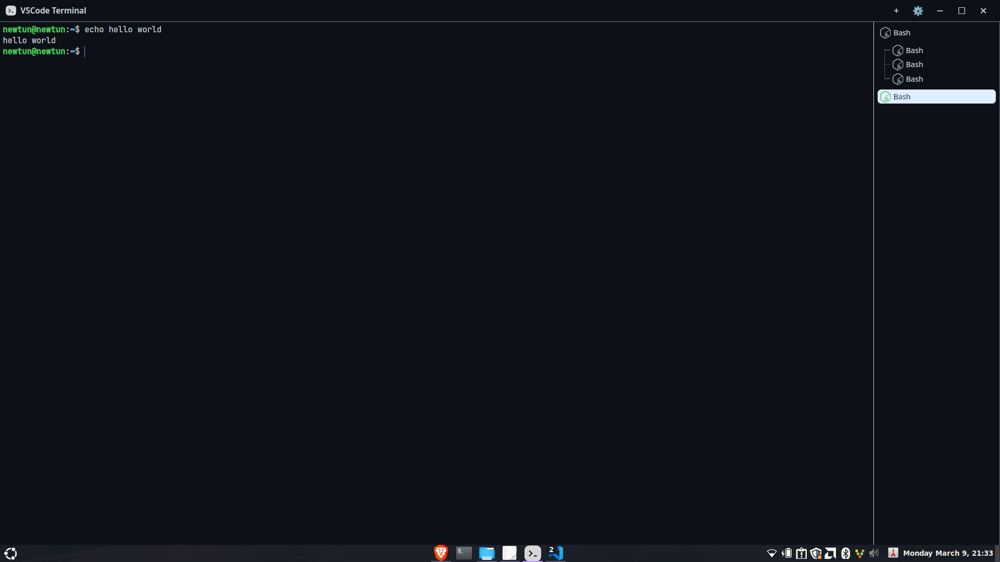

# VS Code Terminal

VS Code Terminal is a lightweight desktop terminal application inspired by the integrated terminal in Visual Studio Code.  
It is built using **Tauri**, **Angular**, and **TailwindCSS** to provide a fast, modern, and cross-platform terminal experience.

The goal of this project is to recreate the familiar developer workflow of the VS Code terminal while keeping the application lightweight and responsive.

---

## Demo

### Terminal Preview



---

## Features

- VS Code–inspired terminal interface
- Lightweight desktop app powered by Tauri
- Modern frontend built with Angular
- Clean and responsive UI with TailwindCSS
- Cross-platform support (Windows, Linux)
- Fast startup and low memory usage
- Simple and developer-friendly architecture

---

## Tech Stack

- **Tauri** – Desktop application framework
- **Angular** – Frontend framework
- **TailwindCSS** – Styling
- **Rust** – Backend runtime used by Tauri

---

## Installation

### Clone the repository

```bash
git clone https://github.com/VinhTin-AQUA/vsc-terminal
cd vsc-terminal
```

### Install dependencies

```bash
npm install
```

### Run in development mode

```bash
npm run tauri dev
```

---

## Build

To build the desktop application:

```bash
# Windows
npm run tauri build -- --target x86_64-pc-windows-msvc
npm run tauri build -- --no-bundle --target x86_64-pc-windows-msvc

# Linux (run on Linux)
npm run tauri build
```

---

## Development

Run Angular only:

```bash
ng g
```

Run the full desktop application:

```bash
npm run tauri dev
```

---

## Roadmap

Planned features:

- Terminal tabs
- Split terminal view
- Shell customization
- Theme support
- Command history

---

## Inspiration

This project is inspired by the integrated terminal experience in Visual Studio Code.
